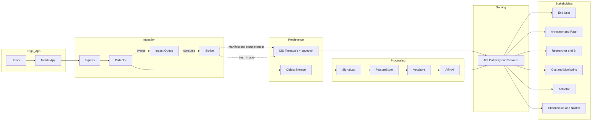

# リアルタイム脳波解析システム（ESP32 × Flutter × Python）

---

## 目次

- [リアルタイム脳波解析システム（ESP32 × Flutter × Python）](#リアルタイム脳波解析システムesp32--flutter--python)
  - [目次](#目次)
  - [1. はじめに](#1-はじめに)
    - [目的](#目的)
    - [到達点（要約）](#到達点要約)
    - [非目標](#非目標)
  - [2. 全体像](#2-全体像)
    - [データフロー](#データフロー)
  - [3. システムアーキテクチャ](#3-システムアーキテクチャ)
    - [アーキテクチャの特徴](#アーキテクチャの特徴)
      - [サービス一覧](#サービス一覧)
  - [4. デバイス仕様とデータ取得](#4-デバイス仕様とデータ取得)
    - [デバイス（ESP32-S3, 8ch）](#デバイスesp32-s3-8ch)
    - [パケット／圧縮](#パケット圧縮)
    - [送信メタデータ（必須）](#送信メタデータ必須)
    - [アプリ／UI](#アプリui)
  - [5. 時刻同期と 10 秒エポック整合性](#5-時刻同期と-10-秒エポック整合性)
    - [定義](#定義)
    - [保存時刻](#保存時刻)
    - [補正モデル](#補正モデル)
    - [アライン規則](#アライン規則)
    - [エポック確定と遅延許容](#エポック確定と遅延許容)
    - [品質指標（例）](#品質指標例)
  - [6. ストレージ戦略（命名・マニフェスト・ILM）](#6-ストレージ戦略命名マニフェストilm)
    - [レイヤと前提](#レイヤと前提)
    - [オブジェクトキー設計（例）](#オブジェクトキー設計例)
      - [補足（ホットスポット回避・パーティション）](#補足ホットスポット回避パーティション)
    - [メタデータ／タグ／サイドカー](#メタデータタグサイドカー)
    - [エポック・マニフェスト `epoch_manifest.v1.json`](#エポックマニフェスト-epoch_manifestv1json)
    - [ILM（Information Lifecycle Management）](#ilminformation-lifecycle-management)
  - [7. データベース設計（PostgreSQL/TimescaleDB/pgvector）](#7-データベース設計postgresqltimescaledbpgvector)
    - [7.1 設計原則](#71-設計原則)
    - [7.2 主なエンティティ](#72-主なエンティティ)
    - [7.3 スキーマと DDL](#73-スキーマと-ddl)
      - [0) 前提拡張](#0-前提拡張)
      - [1) セッション × チャネル整合性](#1-セッション--チャネル整合性)
      - [2) エポック仕様の DB 担保](#2-エポック仕様の-db-担保)
      - [3) 生信号ハイパーテーブルとポリシー](#3-生信号ハイパーテーブルとポリシー)
      - [4) 同期メディア（音声・画像）](#4-同期メディア音声画像)
      - [5) 期間検索・参照の主経路（インデックス）](#5-期間検索参照の主経路インデックス)
      - [6) ベクトル保存（pgvector）と版管理](#6-ベクトル保存pgvectorと版管理)
      - [7) ポリシーとジョブの整備（Timescale 連続集約の例）](#7-ポリシーとジョブの整備timescale-連続集約の例)
    - [7.4 運用ノート](#74-運用ノート)
    - [ベクトル保存（Embeddings）](#ベクトル保存embeddings)
      - [目的と前提](#目的と前提)
      - [配置方針（3 層）](#配置方針3-層)
      - [典型フロー](#典型フロー)
      - [型・精度・コスト指針](#型精度コスト指針)
      - [ライフサイクルとタグ](#ライフサイクルとタグ)
  - [8. Data Ingestion API 仕様](#8-data-ingestion-api-仕様)
    - [共通](#共通)
    - [音声（`audio_10s_v1`）](#音声audio_10s_v1)
    - [EEG（`eeg_raw_v1`）](#eegeeg_raw_v1)
    - [画像（`image_epoch_v1` メタ）](#画像image_epoch_v1-メタ)
    - [冪等と重複](#冪等と重複)
  - [9. API 群の役割境界](#9-api-群の役割境界)
  - [10. 解析パイプライン](#10-解析パイプライン)
    - [解析パラメータ（SignalLab）](#解析パラメータsignallab)
  - [11. セキュリティとガバナンス](#11-セキュリティとガバナンス)
    - [データ保護原則](#データ保護原則)
    - [RLS 設定例](#rls-設定例)
  - [12. 運用とモニタリング](#12-運用とモニタリング)
    - [データ保持の推奨](#データ保持の推奨)
    - [パフォーマンスと可観測性](#パフォーマンスと可観測性)
    - [主要 SLO/指標](#主要-slo指標)
  - [13. 用語統一表（和英・型・単位）](#13-用語統一表和英型単位)
  - [14. 編集ガイド（構造・表記・LLM 最適化）](#14-編集ガイド構造表記llm-最適化)
    - [構造](#構造)
    - [表記](#表記)
    - [LLM 最適化](#llm-最適化)

---

## 1. はじめに

### 目的

- 自作 8ch 脳波計（ESP32-S3）とスマートフォンアプリを用い、EEG/音声/画像などのマルチモーダルデータを 10 秒エポックを基準にリアルタイム解析する。
- ユーザーの状況を把握し、その結果得られる高品質データをビッグデータ基盤として社会へ還元する。

### 到達点（要約）

- ユーザー支援アプリの提供（状態分析・期待値定義・進捗評価・障壁削減）。
- 生体信号とシーン情報の統合により潜在的欲求を推定し、研究・産業活用へ展開。

### 非目標

- 端末ファームウェア詳細設計や個別モデル学習の詳細は本 README の対象外。

---

## 2. 全体像

### データフロー

1. デバイスが 10 秒単位でデータを生成・ブロック化し、アプリ経由で送信。
2. Ingress/Collector が受領・冪等検査・時刻補正・ストレージ配置。
3. マニフェストにより各エポックの完全性・ベスト画像を確定。
4. SignalLab → FeatureStore → VecStore が解析・特徴量配布・検索を実施。
5. 上位アプリケーションが指標・検索・推論結果を利用。



- デバイスが 10 秒単位でデータを生成・ブロック化し、アプリ経由で送信する。
- Ingress/Collector が受領し、冪等検査・ストレージ配置・イベント発行を行う。
- Scribe がイベントを消費し、S3 を参照してエポックのマニフェストを更新し、`completeness` と `best_image` を確定する。
- SignalLab → FeatureStore → VecStore → AffinAI が解析・特徴量配布・検索・推定を実施する。
- API を介して End User／Annotator／Researcher／Ops／Actuator／ChannelHub/Notifier が利用する。

---

## 3. システムアーキテクチャ

### アーキテクチャの特徴

- 10 秒エポック中心の整合設計（画像は中点 5.0 秒 ±0.5 秒を基準）。
- オブジェクトストレージ中心の長期保存＋行指向 DB によるオンライントランザクション。
- Parquet/Hive 互換の列指向により分析とアーカイブを両立。

#### サービス一覧

| サービス         | 主な言語   | 役割                                                       |
| ---------------- | ---------- | ---------------------------------------------------------- |
| **Ingress**      | TypeScript | TLS 終端、JWT 検証、レート制御、内部ルーティング           |
| **Collector**    | TypeScript | 受信、zstd 展開、冪等 UPSERT、キュー投入、時刻補正メタ付与 |
| **Scribe**       | TypeScript | DB 書き込み集約、監査、エポック確定、Outbox/DLQ            |
| **SignalLab**    | Python     | EEG 解析（PSD/Coherence）、変化点検知（MNE-Python）        |
| **AffinAI**      | Python     | ベクトル検索＋ LLM 推定（LangChain 等）                    |
| **VecStore**     | Python     | 埋め込み生成・pgvector 検索 API                            |
| **FeatureStore** | Python     | 連続集約・特徴量配布（10 秒粒度）                          |
| **Actuator**     | TypeScript | 行動計画の実行、外部 API 呼出、権限制御                    |
| **Rater**        | TypeScript | ユーザー評価収集・ラベリング UI/API                        |
| **ChannelHub**   | TypeScript | LINE/Discord/WebSocket 連携                                |
| **Notifier**     | TypeScript | モバイル/OS プッシュ配信                                   |

---

## 4. デバイス仕様とデータ取得

### デバイス（ESP32-S3, 8ch）

- サンプリング: 300 Hz × 8ch
- サンプル構造（68B/点, Little Endian）: EEG `uint16×8`（16B）+ IMU `float×12`（48B）+ `timestamp uint32` μs（4B, 起動からの経過）
- パケット: 150 サンプル/パケット（0.5 秒）
- BLE: NUS 互換 UUID、約 500B/notify 分割、ACK 1B/パケット

### パケット／圧縮

- 方式: Zstandard（zstd）
- フレーミング: 先頭 4B に圧縮後サイズ（`uint32 LE`）
- チャンク分割: `min(500, MTU-7)` を目安

### 送信メタデータ（必須）

- `device_id`, `session_id`, `block_seq`
- `device_monotonic_ts_ms`（単調時刻, ms）
- センサー別: `sampling_rate_hz`, `bit_depth`, `channels`, ほか

### アプリ／UI

- 表示窓: 5 秒（リングバッファ）
- 再描画周期: 2 秒
- ダウンサンプリング: 6（表示負荷低減）
- Valence: 直近 1 秒（300 点）の左右電力差ログを約 0.5 秒ごと更新
- Y 軸: 初期 1500–2500（ADC 値）、データに応じて上下に +15% マージンで自動拡張

---

## 5. 時刻同期と 10 秒エポック整合性

### 定義

### 保存時刻

- `device_monotonic_ts`（単調時刻）
- `gateway_received_ts`（モバイル受信）
- `ingested_ts`（サーバ受信）
- `corrected_utc_ts`（補正済み UTC）

- `corrected_utc_ts_ms`: 単調時刻を基に補正した UTC（ms）
- `epoch_id = floor(corrected_utc_ts_ms / 10_000)`
- `epoch_start = epoch_id * 10_000`（ms）
- `epoch_midpoint = epoch_start + 5_000`（ms）

### 補正モデル

- 線形回帰 `corrected_utc_ts = a * device_monotonic_ts + b`（滑動ウィンドウで a,b 更新）

### アライン規則

- 画像: 中点目標。`|image_ts_ms - epoch_midpoint| <= 500` を満たす最小差の画像を **best_image** とする。
- 音声: 10 秒セグメント（許容誤差 ±0.1 秒）。
- EEG: エポック内 `sample_index`（0..sr\*10-1）で順序保証。

### エポック確定と遅延許容

- グレース: +60 秒で確定イベント発行。未着モダリティは欠損として扱う。

### 品質指標（例）

- `timing_skew_ms`（p50/p95）、`sync_quality`、`max_correction_ms`、`completeness`、`dup_ratio`

---

## 6. ストレージ戦略（命名・マニフェスト・ILM）

### レイヤと前提

- 環境分離: `prod/`, `stg/`
- レイヤ: `raw/`（不可変）→ `curated/`（正規化）→ `analytics/`（Parquet・特徴量）
- PII は別スコープで隔離（専用バケット/別アカウント）し、ID 間接参照。

### オブジェクトキー設計（例）

```text
s3://bucket/
  tenant_id=/device_id=/session_id=/epoch_id=/
    eeg/part-<block_seq>.zst
    audio/part-<block_seq>.flac
    image/<capture_ts_ms>.jpg
    meta/epoch_manifest.v1.json
```

#### 補足（ホットスポット回避・パーティション）

- 先頭をランダム化してホットスポット回避（例: `p=<2hex>/` に `sha1(session_id)` 先頭 1 バイト）
- 多段パーティション: `tenant_id/dt=YYYY-MM-DD/hour=HH/session_id/epoch_id/...`
- Hive/Glue 互換の `key=value` パーティションを採用

### メタデータ／タグ／サイドカー

- オブジェクトメタ例: `x-meta-payload_type`, `x-meta-sampling_rate_hz`, `x-meta-..._quality_ms`, `x-meta-idempotency_key`, `x-meta-checksum-sha256`
- タグ例: `tier=hot|warm|cold`, `pii=true|false`, `retention_class=raw90d|feat1y|archive`, `tenant=<id>`
- サイドカー `.meta.json`: スキーマ版、生成ツール、チェックサム、複数時刻（補正 UTC 等）、品質指標、再送フラグ、`epoch_start` と `epoch_midpoint_offset_ms`

### エポック・マニフェスト `epoch_manifest.v1.json`

- 目的: エポック単位の到着・整合・参照を確定。
- 例:

```json
{
  "schema": "epoch_manifest.v1",
  "tenant_id": "t_123",
  "device_id": "d_abc",
  "session_id": "s_xyz",
  "epoch_id": 123456789,
  "completeness": { "eeg": 1.0, "audio": 0.95, "image": 0.8 },
  "best_image": {
    "object_key": ".../image/1693380005000.jpg",
    "delta_ms": 120
  },
  "objects": {
    "eeg": [".../eeg/part-42.zst"],
    "audio": [".../audio/part-42.flac"],
    "image": [".../image/1693380005000.jpg"]
  },
  "stats": { "timing_skew_p50_ms": 80, "timing_skew_p95_ms": 420 }
}
```

- 判定: `completeness` に EEG/音声/画像の到着可否を記録。画像は `|capture_offset_ms - 5000| <= 500` を満たす最小差を **best_image** として指名
- 運用: 追記型。Inventory 照合で欠損・孤児を検知

### ILM（Information Lifecycle Management）

- クラス:

  - **Gold**: 全モダリティ整合・長期保持
  - **Silver**: 主要モダリティ整合（EEG/音声）
  - **Bronze**: 到着のみ（整合未確定）

- 推奨保持: Gold 5+ 年 / Silver 1–3 年 / Bronze 30–180 日（後段は集約・圧縮・削除）
- 画像: Gold=原本、Silver=AVIF/WEBP プロキシ、音声は FLAC/Opus で容量削減

- 運用ルール:
  - 90 日時点でクラス分けを確定（Gold/Silver/Bronze）し、移行・集約・削除を実施
  - 無作為サンプリング 5–10% を Gold 升格候補として長期保持し、回帰検証に利用
  - `raw/` は 30–90 日、`curated/` は約 1 年、`analytics/` は長期（Parquet 最適化）を目安とする

---

## 7. データベース設計（PostgreSQL/TimescaleDB/pgvector）

本節は v3-2 の DDL と運用規約を読みやすく再構成したものです。適用順序は「列追加 → インデックス → 制約 NOT VALID → バックフィル → VALIDATE → ポリシー有効化」を基本とします。

### 7.1 設計原則

- 10 秒を基本単位とするエポック整合性を DB で強制
- 二次元パーティション（時間 × セッション）でホットスポットを回避
- 解析成果物（特徴量・埋め込み）の参照整合性を複合 FK で担保
- 圧縮・保持・再並べ替えをポリシー化して運用自動化
- RLS によるマルチテナント隔離を徹底

### 7.2 主なエンティティ

- セッション系: `recording_sessions`, `channels`, `session_channels`
- 時間構造: `epochs`（10 秒固定）
- 原データ: `bio_signal_raw`（ハイパーテーブル）, `imu_raw`
- 同期メディア: `audio_chunks`, `epoch_images`
- 解析成果: `features`, `embeddings`
- メタ・注釈: `events`, `time_labels`

### 7.3 スキーマと DDL

#### 0) 前提拡張

```sql
-- 必須拡張
CREATE EXTENSION IF NOT EXISTS timescaledb;
CREATE EXTENSION IF NOT EXISTS vector;         -- pgvector
CREATE EXTENSION IF NOT EXISTS pgcrypto;       -- UUID 生成等で利用する場合

-- 代表シーケンス・型（必要に応じて）
-- CREATE EXTENSION IF NOT EXISTS "uuid-ossp";
```

#### 1) セッション × チャネル整合性

```sql
CREATE TABLE IF NOT EXISTS session_channels (
  session_id UUID NOT NULL REFERENCES recording_sessions(session_id) ON DELETE CASCADE,
  channel_id SMALLINT NOT NULL REFERENCES channels(channel_id),
  PRIMARY KEY (session_id, channel_id)
);

ALTER TABLE bio_signal_raw
  ADD CONSTRAINT fk_bio_raw_session_channel
  FOREIGN KEY (session_id, channel_id)
  REFERENCES session_channels(session_id, channel_id)
  DEFERRABLE INITIALLY DEFERRED;
```

#### 2) エポック仕様の DB 担保

- 10 秒バケットは丸め誤差を避け、UNIX 時間を 10 で割って `floor` した値で一意化します。
- エポック完了の可観測性を `epochs` に集約します。

```sql
-- 生信号に厳密な 10 秒バケットを導出（既存列を壊さず併設）
ALTER TABLE bio_signal_raw
  ADD COLUMN IF NOT EXISTS epoch_id BIGINT;  -- 既存ならスキップ
ALTER TABLE bio_signal_raw
  ADD COLUMN IF NOT EXISTS epoch_id_gen BIGINT GENERATED ALWAYS AS (
    floor(EXTRACT(EPOCH FROM corrected_utc_ts) / 10.0)::BIGINT
  ) STORED;

-- 既存の epoch_id がある場合は一致を検証（ズレ検出用）
ALTER TABLE bio_signal_raw
  ADD CONSTRAINT chk_bio_epoch_match
  CHECK (epoch_id IS NULL OR epoch_id = epoch_id_gen) NOT VALID;

-- エポックの完了判定・可観測性（Collector 連携）
ALTER TABLE epochs
  ADD COLUMN IF NOT EXISTS completeness JSONB NOT NULL DEFAULT '{}'::jsonb,
  ADD COLUMN IF NOT EXISTS ready_at TIMESTAMPTZ,
  ADD COLUMN IF NOT EXISTS image_ok BOOLEAN GENERATED ALWAYS AS ((completeness->>'IMAGE_OK')::BOOLEAN) STORED,
  ADD COLUMN IF NOT EXISTS audio_ok BOOLEAN GENERATED ALWAYS AS ((completeness->>'AUDIO_OK')::BOOLEAN) STORED,
  ADD COLUMN IF NOT EXISTS eeg_ok   BOOLEAN GENERATED ALWAYS AS ((completeness->>'EEG_OK')::BOOLEAN)   STORED;
```

#### 3) 生信号ハイパーテーブルとポリシー

```sql
-- ハイパーテーブル（二次元: time × session）
SELECT create_hypertable('bio_signal_raw', 'time', 'session_id', 64, if_not_exists => TRUE);

-- 圧縮・セグメント設定とポリシー
ALTER TABLE bio_signal_raw
  SET (timescaledb.compress,
       timescaledb.compress_orderby = 'time DESC',
       timescaledb.compress_segmentby = 'session_id,channel_id');

SELECT add_compression_policy('bio_signal_raw', INTERVAL '30 days');
SELECT add_retention_policy('bio_signal_raw',   INTERVAL '180 days');

-- 再並べ替えポリシーが参照するカバリングインデックスを明示
CREATE INDEX IF NOT EXISTS bio_raw_epoch_idx
  ON bio_signal_raw (session_id, epoch_id, channel_id, time DESC);

SELECT add_reorder_policy('bio_signal_raw', 'bio_raw_epoch_idx');

-- EEG 取込の冪等性キー（再送安全）
CREATE UNIQUE INDEX IF NOT EXISTS bio_raw_idempotent
  ON bio_signal_raw (session_id, block_seq)
  WHERE block_seq IS NOT NULL;
```

#### 4) 同期メディア（音声・画像）

```sql
-- 音声: 10 秒 ±0.1 秒の実長を保持して検証
ALTER TABLE audio_chunks
  ADD COLUMN IF NOT EXISTS ts_start TIMESTAMPTZ,
  ADD COLUMN IF NOT EXISTS ts_end   TIMESTAMPTZ,
  ADD COLUMN IF NOT EXISTS duration_sec DOUBLE PRECISION;

ALTER TABLE audio_chunks
  ADD CONSTRAINT chk_audio_window
  CHECK (
    ts_start IS NULL OR ts_end IS NULL
    OR abs(EXTRACT(EPOCH FROM (ts_end - ts_start)) - 10.0) <= 0.1
  ) NOT VALID;

-- 画像: 中点 5.0 秒 ±500 ms を満たすものを優先（存在する場合のチェック）
ALTER TABLE epoch_images
  ADD CONSTRAINT chk_image_midpoint
  CHECK (
    meta ? 'capture_offset_ms'
    AND abs(((meta->>'capture_offset_ms')::INT) - 5000) <= 500
  ) NOT VALID;

CREATE INDEX IF NOT EXISTS image_epoch_idx ON epoch_images (session_id, epoch_id);
CREATE INDEX IF NOT EXISTS image_user_ts_idx ON epoch_images (user_id, captured_at DESC);

-- Timescale を適用する場合（任意）
-- SELECT create_hypertable('audio_chunks', 'ts_start', 'session_id', 64, if_not_exists => TRUE);
-- SELECT create_hypertable('epoch_images', 'captured_at', 'session_id', 64, if_not_exists => TRUE);
-- SELECT add_retention_policy('audio_chunks', INTERVAL '90 days');
-- SELECT add_retention_policy('epoch_images', INTERVAL '90 days');
```

#### 5) 期間検索・参照の主経路（インデックス）

```sql
-- 期間検索の主経路
CREATE INDEX IF NOT EXISTS features_session_epoch_idx
  ON features (session_id, epoch_id);

CREATE INDEX IF NOT EXISTS events_user_ts_idx
  ON events (user_id, ts DESC);

CREATE INDEX IF NOT EXISTS labels_user_ts_idx
  ON time_labels (user_id, ts DESC);

-- JSONB よく使うキーに部分 GIN（例）
-- CREATE INDEX IF NOT EXISTS image_meta_gin ON epoch_images USING GIN ((meta->'qc')) WHERE meta ? 'qc';
```

#### 6) ベクトル保存（pgvector）と版管理

埋め込みはモデルと前処理に依存する派生物であり、正本はオブジェクトストレージに保持し、DB には台帳と検索用の最小限を置きます。

```sql
-- 次元は運用の既定に合わせて固定（例: 768）
ALTER TABLE embeddings
  ALTER COLUMN vec TYPE vector(768);

-- 版と互換性
ALTER TABLE embeddings
  ADD COLUMN IF NOT EXISTS embed_v INT NOT NULL DEFAULT 1,
  ADD COLUMN IF NOT EXISTS schema_v INT NOT NULL DEFAULT 1,
  ADD COLUMN IF NOT EXISTS model_id TEXT;  -- text-encoder-YYYY-MM-DD 等

-- 同一オブジェクトに対する重複生成を抑止
ALTER TABLE embeddings
  ADD CONSTRAINT uq_embeddings_owner_model_ver
  UNIQUE (owner_type, owner_id, model_id, embed_v);

-- 類似検索の経路（必要に応じて HNSW/IVFFLAT）
-- CREATE INDEX IF NOT EXISTS embeddings_vec_hnsw
--   ON embeddings USING hnsw (vec vector_l2_ops);
```

#### 7) ポリシーとジョブの整備（Timescale 連続集約の例）

```sql
-- 生信号: 連続集約や再圧縮を運用に合わせて追加
-- 例) 連続集約テーブル作成とポリシーの設定（必要に応じて）
-- CREATE MATERIALIZED VIEW bio_signal_epoch_agg
-- WITH (timescaledb.continuous) AS
-- SELECT session_id, epoch_id, channel_id,
--        min(value) AS v_min, max(value) AS v_max, avg(value) AS v_avg
-- FROM bio_signal_raw
-- GROUP BY 1,2,3;

-- SELECT add_continuous_aggregate_policy('bio_signal_epoch_agg',
--   start_offset => INTERVAL '7 days',
--   end_offset   => INTERVAL '1 hour',
--   schedule_interval => INTERVAL '15 minutes');
```

### 7.4 運用ノート

- すべての `ALTER TABLE ... ADD CONSTRAINT ... NOT VALID` はバックフィル完了後に `VALIDATE CONSTRAINT` を実施します。
- 大規模テーブルへのインデックス作成は `CONCURRENTLY` の利用を検討します。
- `retention_policy` と `compression_policy` は検証後に適用し、SLA とコストに合わせて調整します。

---

### ベクトル保存（Embeddings）

#### 目的と前提

- ベクトルはモデルと前処理に依存する派生物。再生成可能だが、再現性・監査・回帰評価のため「正本（オフライン）」を保持する。
- オンライン検索用途は低レイテンシを最優先し、索引は再構築可能なキャッシュとして扱う。

#### 配置方針（3 層）

1. **正本（ソース・オブ・トゥルース）**: Parquet（`float16/32`）で長期保管。`model_id`・`preproc`・`dim`・`checksum` を付帯。
2. **オンライン索引**: pgvector/HNSW。必要に応じ PQ/OPQ 圧縮。日次〜週次スナップショットを保存しロールバック可能に。
3. **台帳（メタ）**: 所在・モデル・版・状態・削除伝搬を管理（ベクトル本体は保持しない）。

#### 典型フロー

1. 特徴量 → 埋め込み生成
2. 台帳に `PENDING` で登録
3. Parquet へ追記（新規シャード作成）
4. オンライン索引へロード（またはバッチ再構築）→ 台帳を `READY` に遷移
5. インデックスのスナップショットをオブジェクトストレージへ保存

#### 型・精度・コスト指針

- 既定は `float16`。高精度が必要な領域のみ `float32` を併存
- オンラインは PQ/OPQ 等で圧縮し、再ランク用に一部の原ベクトル（`float16`）を同居

#### ライフサイクルとタグ

- 正本: `retention_class=feat_long`（長期）
- オンライン索引: `retention_class=index_snap`（近傍 N 世代保持）
- 台帳: 運用ニーズに応じ TTL を設定

## 8. Data Ingestion API 仕様

### 共通

- ベース: `POST /v1/ingest/<modality>`（`eeg`/`audio`/`image`/`meta`）
- ヘッダ: `X-Idempotency-Key`, `X-Session-Id`, `X-Block-Seq`, `Content-Type`
- 認証: OAuth2 Client Credentials または mTLS
- 冪等性: `(session_id, block_seq)` をキーに受領一意化（画像は `(session_id, epoch_id)`）

### 音声（`audio_10s_v1`）

```json
{
  "device_id": "uuid",
  "session_id": "uuid",
  "epoch_id": 173534567,
  "codec": "wav",
  "sample_rate": 16000,
  "uri": "s3://bucket/path/audio.wav",
  "duration_sec": 10.0,
  "payload_type": "audio_10s_v1"
}
```

### EEG（`eeg_raw_v1`）

```json
{
  "device_id": "uuid",
  "session_id": "uuid",
  "block_seq": 12345,
  "sampling_rate_hz": 300,
  "epoch_id": 173534567,
  "epoch_start_wallclock": "2025-08-27T12:00:00Z",
  "device_monotonic_ts_start": 1234567890,
  "channel_map": ["FP1", "FP2", "F7", "F8", "T7", "T8", "P7", "P8"],
  "payload_type": "eeg_raw_v1",
  "samples_per_channel": 3000
}
```

### 画像（`image_epoch_v1` メタ）

```json
{
  "device_id": "d_abc",
  "session_id": "s_xyz",
  "block_seq": 42,
  "capture_corrected_utc_ts": "2025-08-27T12:00:05.012Z",
  "capture_offset_ms": 512,
  "device_monotonic_ts_ms": 1693380005012,
  "exif": { "iso": 200, "exposure_ms": 10 },
  "payload_type": "image_epoch_v1"
}
```

- 評価: `abs(capture_offset_ms - 5000) <= 500` を満たすかで中点整合を判定。より近い画像を採用。

### 冪等と重複

- EEG/IMU 等: `(session_id, block_seq)` のユニーク制約。既存なら 200 OK（スキップ）。
- 画像: `(session_id, epoch_id)`。再送は中点近傍比較でより適合なものを採用。

- 書き込み規約:
  - 不可変原則。修正はクエリパラメータ `v=<n>` で新規保存
  - 条件付き PUT（`If-None-Match`）や CAS を使用して衝突を回避
  - チェックサム（SHA-256）を検証し、マルチパート時は独自に集計・確認

---

## 9. API 群の役割境界

- **Ingress**: `/ingest/*` を Collector にプロキシ。JWT 検証・レート制御。
- **Collector**: 冪等チェック → 展開 → `epoch_id` 整合性検証 → キュー投入 → マニフェスト更新。
- **Scribe**: トランザクションで `epochs.completeness` を更新。`IMAGE_OK` は中点 ±500ms のときのみ。
- **FeatureStore**: `GET /features/epoch?session_id=&epoch_id=` で PSD/Coherence/統計を返却。
- **VecStore**: `POST /embeddings`, `POST /search`（pgvector/HNSW）。

---

## 10. 解析パイプライン

- トリガ: エポック完了（`completeness` が閾値達成）
- **SignalLab**: EEG → PSD/Coherence → `features` 保存
- **AffinAI**: 特徴量 + シーン → ベクトル検索 → LLM 推定 → `events`/`time_labels`
- リトライ: 遅延到着はグレース内で再集約。満了後の欠損は下流へ欠損として伝搬。

### 解析パラメータ（SignalLab）

- 解析窓: 2 秒（300 Hz × 2 秒）
- PSD: 1–45 Hz、`n_fft=300`、実行間隔 10 秒
- コヒーレンス: 8–13 Hz（α 帯）、実行間隔 10 秒
- 結果配信: `/results` に最新画像を保持（クライアントは 10 秒間隔でポーリング）

---

## 11. セキュリティとガバナンス

### データ保護原則

1. PII 分離: 別スキーマ/別バケット、ID 間接参照
2. Row Level Security（RLS）: `tenant_id`/`user_id` ベース
3. 監査ログ: すべてのデータアクセス・DDL・ポリシー変更を記録
4. 暗号化: 保存時・通信時の暗号化
5. 削除要求: GDPR 等の削除要求へ対応

### RLS 設定例

```sql
alter table bio_signal_raw enable row level security;
alter table epochs         enable row level security;
alter table audio_chunks   enable row level security;

create policy bio_raw_tenant_isolation on bio_signal_raw
  using (tenant_id = current_setting('app.tenant_id')::uuid);

create policy epochs_owner on epochs for all
  using (session_id in (
    select session_id from recording_sessions
    where user_id = current_setting('app.current_user_id')::uuid
  ));
```

---

## 12. 運用とモニタリング

### データ保持の推奨

- 原データ: 30–90 日（TimescaleDB）
- 集約データ: 1 年
- アーカイブ: Parquet on S3（無期限）

### パフォーマンスと可観測性

- 主要インデックス: 時系列 `(session_id, epoch_id, channel_id, time desc)`、JSONB GIN、テキスト検索 `tsvector`
- OpenTelemetry による分散トレース（主要タグ: `session_id`, `epoch_id`）

### 主要 SLO/指標

- 取り込み成功率 ≥ 99.5%
- マニフェスト確定 p95 ≤ 2 分
- 画像中点ズレ p95 ≤ 500 ms
- 端末 → 特徴量配布の遅延 P50/P95: 2s/5s
- 欠損エポック率 < 0.5%（EEG/音声ベース）
- 再送検知率（`block_seq` 重複）= 100%
- `sync_quality` p95 < 25 ms

---

## 13. 用語統一表（和英・型・単位）

| 用語           | 統一表記                 | 型/単位 | 定義/備考                                                           |
| -------------- | ------------------------ | ------- | ------------------------------------------------------------------- |
| エポック       | epoch                    | -       | 10 秒の時系列バケット                                               |
| エポック ID    | `epoch_id`               | int     | `floor(corrected_utc_ts_ms / 10_000)`                               |
| 補正 UTC       | `corrected_utc_ts_ms`    | ms      | 補正後 UTC 時刻                                                     |
| 単調時刻       | `device_monotonic_ts_ms` | ms      | デバイスの monotonic 基準                                           |
| 中点           | epoch midpoint           | ms      | `epoch_start + 5_000`                                               |
| 画像オフセット | `capture_offset_ms`      | ms      | エポック開始からの撮影オフセット                                    |
| 完全性         | `completeness`           | 0.0–1.0 | モダリティ到着・整合の充足率                                        |
| ベスト画像     | `best_image`             | obj     | 中点に最も近い画像の参照                                            |
| 冪等性         | idempotency              | -       | `(session_id, block_seq)` で保証（画像は `(session_id, epoch_id)`） |
| マニフェスト   | epoch manifest           | json    | `epoch_manifest.v1.json`                                            |
| FeatureStore   | FeatureStore             | -       | 特徴量配布の仕組み                                                  |
| VecStore       | VecStore                 | -       | 埋め込み・近傍検索の仕組み                                          |

---

## 14. 編集ガイド（構造・表記・LLM 最適化）

### 構造

- 見出しは章番号（`# 1.`, `## 1.1`）。節あたり 1 主張。
- セクション先頭に「目的・範囲・前提」。数式・閾値の正本は本章のみに置く。

### 表記

- 時刻は UTC の RFC3339 とミリ秒併記（例: `2025-08-30T12:00:05.012Z / 1693396805012`）
- 単位は SI。許容誤差は ± で明示。
- JSON/コードのキーはスネークケース、バッククォートで囲む。
- 表は列名を短く、単位は列名に後置（例: `duration_sec`）。

### LLM 最適化

- 1 断片 = 1 事実集合（定義・式・制約・手順）。段落 3–5、見出し付き。
- 断片先頭に短い要約行を置き、タグ付けしやすくする。
- 相互参照は章番号リンク（例: [5. 時刻同期](#5-時刻同期と-10-秒エポック整合性)）。

> 以上。必要に応じて、各セクションにさらなる例（JSON/SQL/図）や計測値を追加してください。
